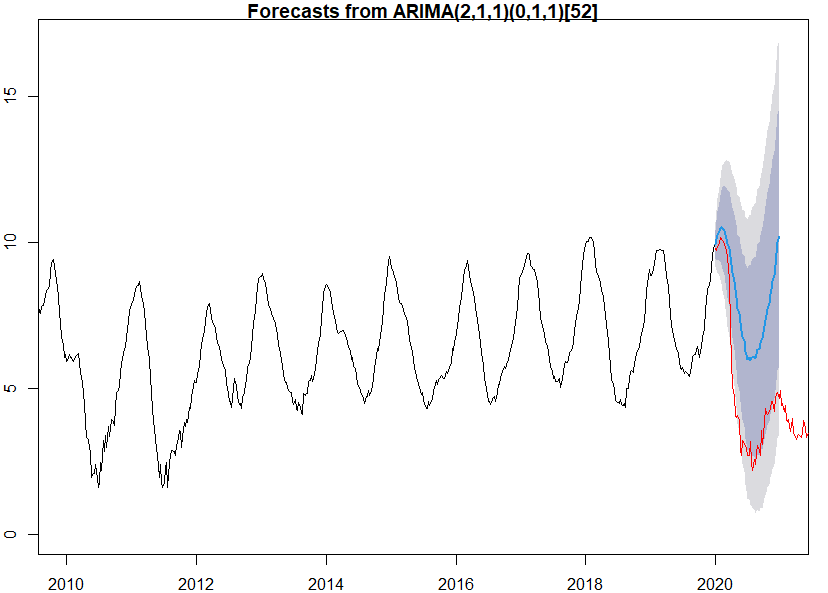

# USA Flu Time-Series Prediction

This repository is dedicated to a comprehensive time-series analysis of influenza trends within the United States. 

The framework adopted is a multifaceted approach that consists of the following key components:

1. **Pattern Recognition**: Initial identification of recurring patterns, seasonality, and anomalies within the historical flu data.
  
2. **Model Estimation**: Formulation and calibration of a mathematical model that encapsulates the underlying mechanics driving flu trends. This includes the use of classical time-series models like ARIMA.

3. **Statistical Validation**: Rigorous evaluation of the constructed model using advanced statistical tests, ensuring its robustness and reliability for predictive analysis.

4. **Predictive Analytics**: Utilizing the validated model to forecast upcoming trends in flu activity.

5. **Outlier Management**: Identification and treatment of anomalous data points that may skew the analysis, thereby ensuring the integrity and accuracy of the study.

6. **Report Generation**: A comprehensive report is encapsulated in 'report.pdf', which provides in-depth insights, visualizations, and the statistical rationale behind the model’s configuration and performance.
